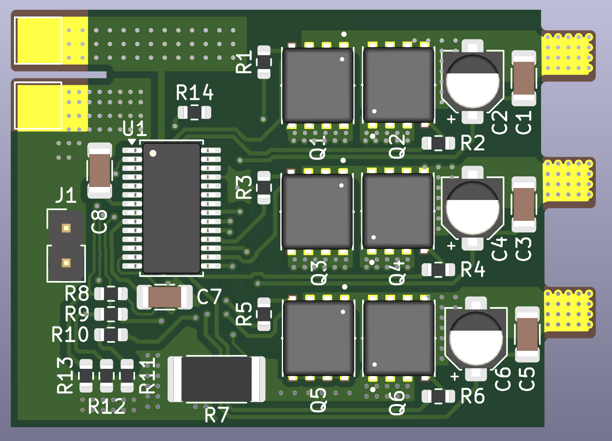
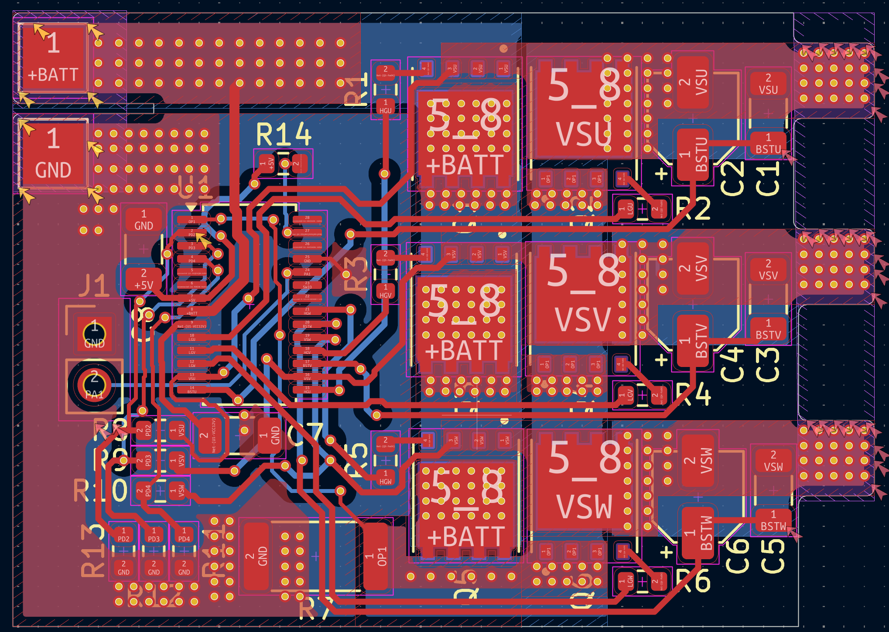
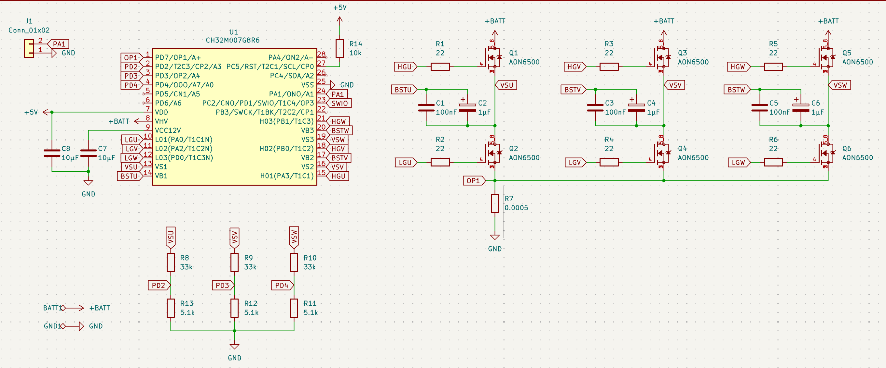

# WCH-45A-ESC

An open-hardware 45A Electronic Speed Controller (ESC) project based on the WCH CH32M007 RISC-V microcontroller.





## Project Overview

This project aims to provide a robust and cost-effective ESC capable of handling continuous currents up to 45A. It utilizes the CH32M007G8R6, a RISC-V MCU specifically designed for motor control applications with integrated op-amps and comparators.

### Why Choose the CH32M007?

The **WCH CH32M007** stands out as a premier choice for modern **motor control applications**. Key advantages include:

- **Integrated Analog Peripherals:** With **3x built-in Op-Amps** and **4x Comparators**, the CH32M007 simplifies **current sensing** and **BEMF detection** layouts, reducing external component count and **BOM cost**.
- **High-Performance RISC-V Core:** The **144MHz QingKe V4F core** delivers the computational speed required for complex **FOC (Field Oriented Control)** loops and high-RPM management.
- **Dedicated Motor Control Logic:** Features advanced timers for complementary PWM generation with hardware dead-time, ensuring safe and efficient **MOSFET switching**.
- **Cost Efficiency:** It offers a highly competitive price point for **BLDC** and **PMSM** driver solutions without compromising on performance.

## Hardware Design

### MOSFET Selection

The power stage is the most critical aspect of this 45A design. We selected the **Alpha & Omega AON6500** N-Channel MOSFET for the following reasons:

1.  **Ultra-Low On-Resistance ($R_{DS(on)}$):** With a typical resistance of **~1.0 mΩ** (at $V_{GS}=10V$), conduction losses ($P = I^2 R$) are drastically reduced. This allows the ESC to handle 45A continuous current with minimal heat generation.
2.  **Thermal Management:** The **DFN5x6** package provides excellent thermal coupling to the PCB copper pours, eliminating the need for bulky external heatsinks in typical airflow conditions.
3.  **Voltage Rating ($V_{DS}$):** The **30V** breakdown voltage offers sufficient headroom for 2S-4S LiPo configurations, capable of withstanding inductive voltage spikes during switching.
4.  **Optimized Gate Charge:** The gate charge is balanced to allow for fast switching speeds (reducing switching losses) while remaining within the drive capability of the gate driver circuitry.

### CH32M007 KiCad Symbol

The custom KiCad schematic symbol and footprint for the **CH32M007G8R6** are included directly in this repository.

- **Location:** See the `root` repo.
- **Usage:** These libraries can be imported into KiCad to modify the design or create new derivatives.

## Firmware & Programming

The firmware source code is located in the `software` folder. The project is specifically configured for **MounRiver Studio 2**.

### How to Program

To flash the firmware onto the CH32M007, you will need a **WCH-LinkE** or compatible programmer.

1.  **Connections:**
    - Connect the **SWDIO**, **SWCLK**, **3V3**, and **GND** pads on the ESC to the WCH-Link.
2.  **Toolchain:**

    - The project is set up to use the `RISC-V Cross GCC` toolchain.
    - Build the project to generate the `.hex` or `.elf` file.

3.  **Flashing:**
    - Use **WCH-LinkUtility** or the built-in flasher in MounRiver Studio.
    - Select the CH32M007 series chip and download the firmware.

## License

This project is licensed under the **CERN Open Hardware Licence Version 2 - Strongly Reciprocal (CERN-OHL-S)**.

```text
CERN Open Hardware Licence Version 2 (Strongly Reciprocal) — CERN-OHL-S v2.0

You may obtain a copy of the license text from CERN:
https://ohwr.org/project/cernohl/wikis/Documents/CERN-OHL-version-2
```

If you redistribute this project (in source or manufactured form), you must comply with the terms of CERN-OHL-S v2.0.
